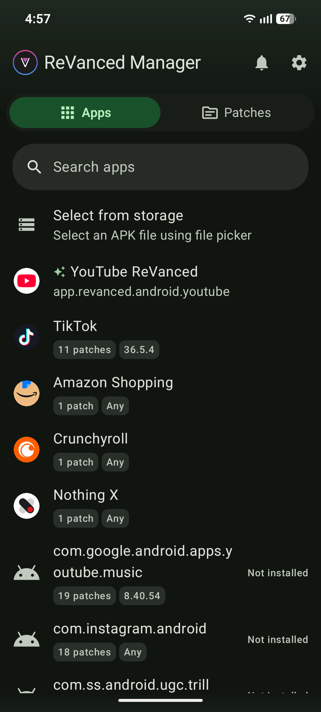

<h2 align=center>ReVanced Manager</h2>
<h3 align=center>A Modern Patcher For Android Apps</h3>

    
Warning!

- Some ReVanced mods are piracy! (such as removing ads without paying for a premium service) Privacy is illegal!

### What is ReVanced?

- ReVanced is an app for Android that patches other apps, giving you features that otherwise wouldn't be available. ReVanced has a large yet still growing collection of supported apps, ranging from YouTube all the way to Amazon.
    - ReVanced does provide paid features too, like letting you completely disable Ads on YouTube

### How do I get ReVanced?

- It's easy! You just download the APK from their official site or their GitHub and then give the app permissions!
    - [ReVanced Site](https://revanced.app/)
    - [ReVanced GitHub](https://github.com/ReVanced/revanced-manager)
