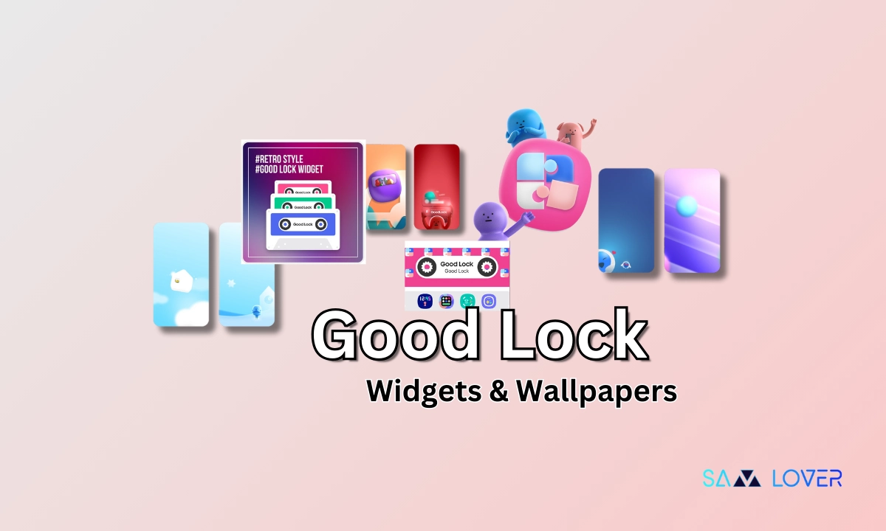

<h2 align=center>Sasmung's Good Lock App</h2>
<h3 align=center>A No-Root Solution To The UI Dillema</h3>

### What Is Good Lock?

- Good Lock is an application suite created by Samsung to bring absolute control for the user to their phones. OneUI (Samsung's version of Android) is already very customizable, but Good Lock takes it to the next level without requiring you to mess with the phone and jailbreak it. You can customize clock interfaces, your status bar, your home screen (to an EXTREME extent), even your volume bar.

- Good Lock's customization methods are split into different apps that control seperate features, you can install these apps through the parent app (Good Lock).

### How To Actually Get Good Lock

- Installing Good Lock is actually very simple! You don't have to join anything like a developer program, you just need to install the app and it works immediately! Installing the app itself is also easy, you don't have to dig through GitHub repositories like this one to find it, you just have to go to the Galaxy Store OR the Google Play Store and search `Good Lock`, then install it!
    - [Google Play](https://play.google.com/store/apps/details?id=com.samsung.android.goodlock&hl=en-US)
    - [Galaxy Store](https://galaxystore.samsung.com/detail/com.samsung.android.goodlock)
