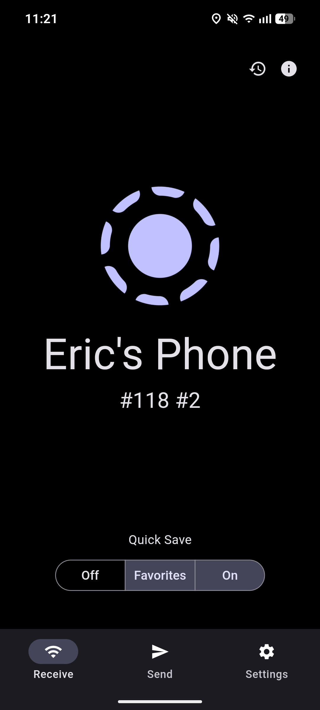
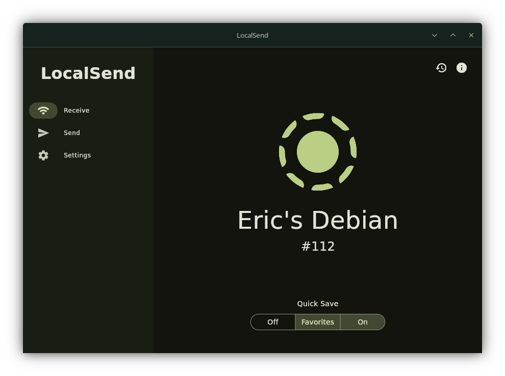
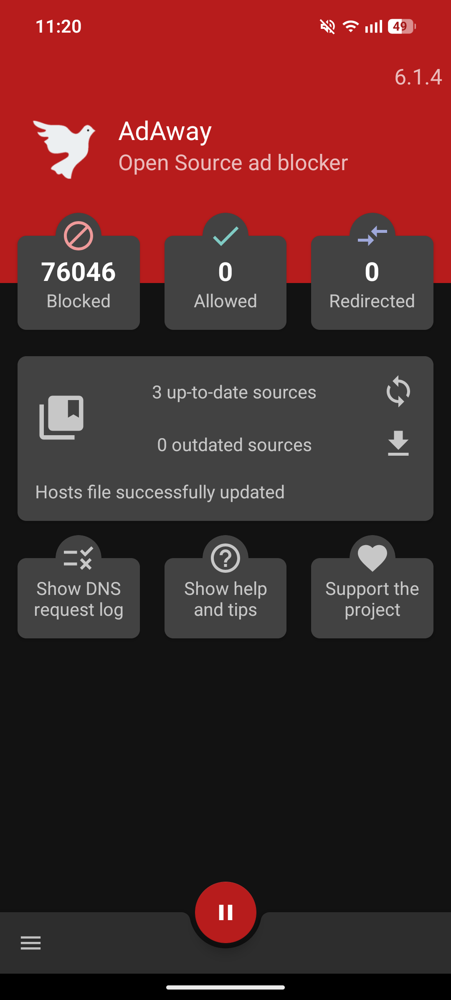
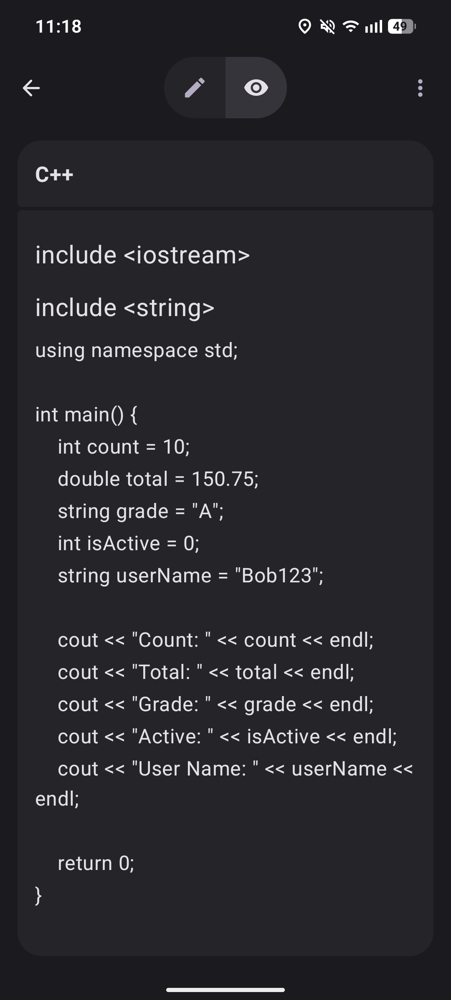
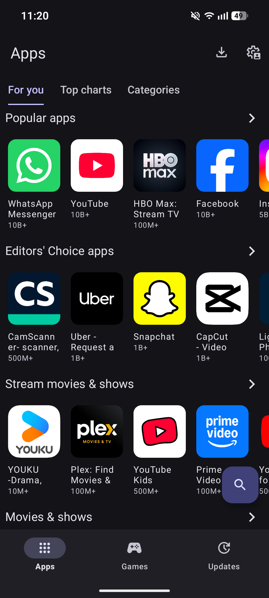

<h2 align=center>Quality of Life</2>
<h3 align=center>Applications That Will Just Make Using Your Android Feel Better</h3>

    
Application List

| **Application** | **Description** |
| :--- | :--- |
| **Localsend** | The Android equivalent to AirDrop! You can seamlessly send files to other devices as long as you are on the same Wi-Fi! |
| **AdAway** | Now, it is more recommended for rooted (jailbroken) users, but if your phone isn't jailbroken, you can still use it, it will just drain more battery. AdAway removes ads from your system, but if you aren't rooted, you shouldn't use it. |
| **Easy Notes** | A very nice looking notes app that respects your privacy, simple. |
| **Aurora Store** | The spyware-free and ad-free alternative to the Google Play Store! It works with both rooted and non-rooted devices. Aurora Store has all the same apps that the Play Store has, but you get them through a much simpler UI! |

<h3 align=center><- Localsend -></h3>

- Localsend is THE BEST Android file transfer app! It is known as the Android AirDrop, that is because it has a nice look, it is fast, it has multiple features, and it is simple enough for ANYONE to use it!
    - You can download Localsend for both Mobile and Desktop [here](https://localsend.org)

<h3 align=center><- AdAway -></h3>

- AdAway is undoubtedly the BEST Android ad blocker if you have root access (if your phone is jailbroken)
    - If your phone isn't rooted, the app still works, but it has to use a VPN, which drains battery in the background.
    - You can download AdAway [here](https://github.com/AdAway/AdAway/releases/download/v6.1.4/AdAway-6.1.4-20241027.apk)

<h3 align=center><- Easy Notes -></h3>

- There isn't much to it. It's easy and it is a notes app. It looks good and doesn't steal your data like Google Keep.
    - Download Easy Notes [here](https://f-droid.org/repo/com.kin.easynotes_14.apk)

<h3 align=center><- Aurora Store -></h3>

- We've all been there, when you go open the Google Play Store just to open an app and there is suddenly an advertisement on your screen or Google is asking for a payment method for a free app, it sucks.
    - Aurora Store fixes that, it is an ad-free, spyware-free, good looking Play Store client that respects you and lets you get your apps quickly.
    - Download Aurora Store [here](https://f-droid.org/repo/com.aurora.store_75.apk)
