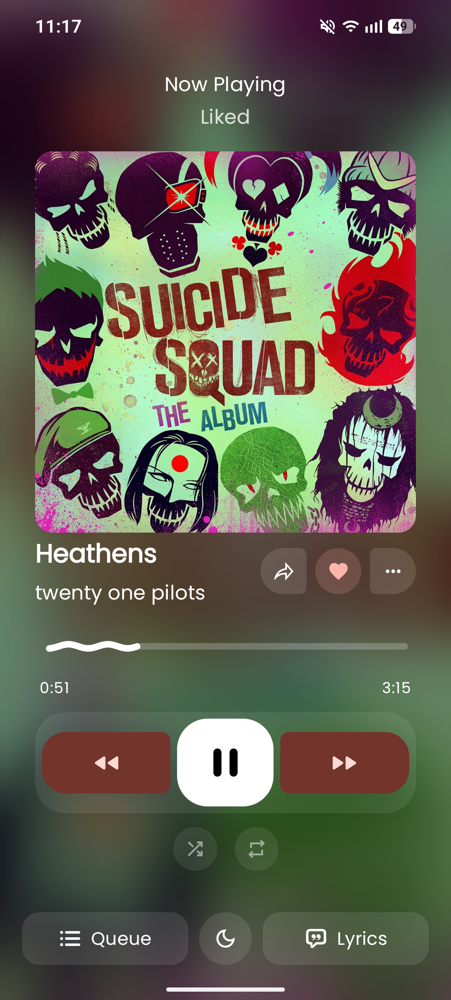
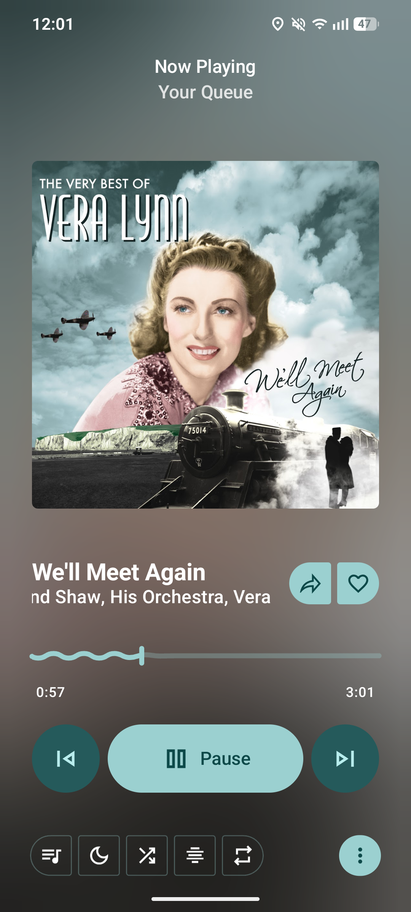
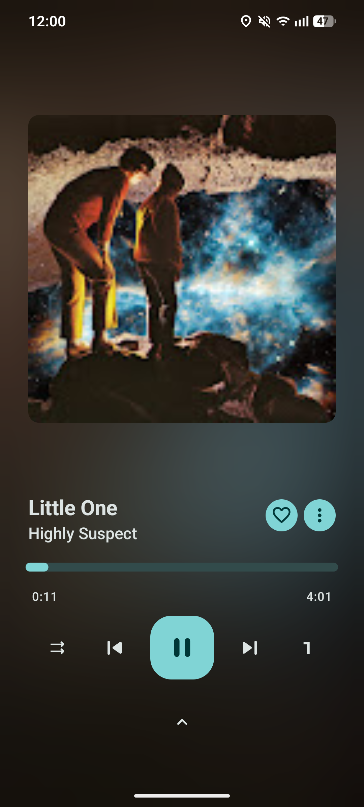

<h2 align=center>Youtube Music Clients</h2>
<h3 align=center>A Collection of Applications That Bring You The YouTube Music Premium Feel!</h3>

    
Read Me First!

Warning!
By installing these apps, you acknowledge that you understand the risks and legalities of these items! These apps directly violate YouTube's Terms Of Service by giving you paid features for free! These applications are also a risk to your privacy! They're free and open source, but they can still be malicious, sure, you can see the code, but no one is actively reading all of it to make sure it is safe!

- **Integrity**: *You're actively putting yourself in a position of piracy*.

- **Privacy**: Your personal information is at risk! If anything asks for unnecessary information, do NOT enter it!

    
Application List

| **Application** | **Description** |
| :--- | :--- |
| **ArchiveTune** | A YouTube Music Client that focuses on the user's QoL (quality of life) |
| **Metrolist** | Similar to ArchiveTune, but it is more stable |
| **OuterTune** | A classic, it has less features/customization, but it runs faster on weaker devices and looks nice! |

<h3 align=center><- ArchiveTune -></h3>

- ArchiveTune is a very customizable Youtube Music client for Android.
    - It has immense UI customization, integration features, backup options, download options, and more!
    - You can download ArchiveTune [here](https://github.com/rukamori/ArchiveTune/releases/download/v13.7.0/app-gms-mobile-arm64-release.apk)

<h3 align=center><- Metrolist -></h3>

- Metrolist is very similar to ArchiveTune, but it is a big lighter and has just a few less customization options, but it is more than good enough for the average user!
    - It has basically everything that ArchiveTune has, but ArchiveTune has a bit more, like optional AI integrations.
    - You can download Metrolist [here](https://github.com/MetrolistGroup/Metrolist/releases/download/v13.6.0/Metrolist-with-Google-Cast.apk)

<h3 align=center><- Outertune -></h3>

- OuterTune is VERY barebones compared to the apps above. It is also... dead. It no longer gets updated and its last update was in 2025, but nonetheless, the app still works.
    - OuterTune is better suited for users who don't need the cool, flashy UI and just want something that works.
    - You can download OuterTune [here](https://github.com/OuterTune/OuterTune/releases/download/v0.10.1/OuterTune-0.10.1-full-release-71.apk)
